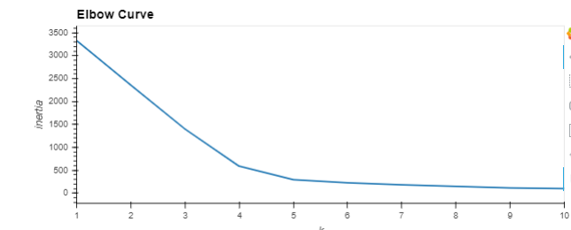
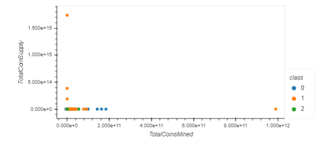
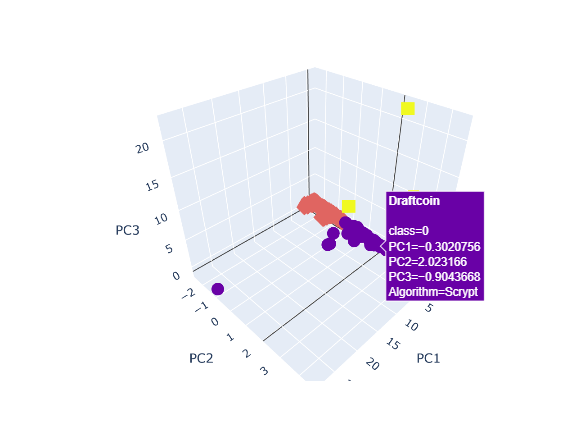
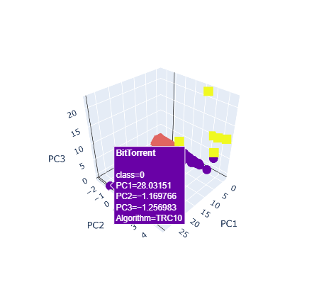

# Cryptocurrencies

Project purpose is to use unsupervised learning to analyze data on the cryptocurrencies traded on the market.
The data was retrieved from CryptoCompare.

### 1. Some data preprocessing tasks have been performed for next steps - dimensions reduction with PCA and clustering with K-means

### 2. Data Dimensions were reduced Using PCA

### 3. Elbow Curve have been used to determine the Best K Value
 

3D plot

The table below shows 

Two outstandidng cryptocurrencies in the table 3 are shown below in 3D graph
 - Draftcoin
 

  - BitTorrent

