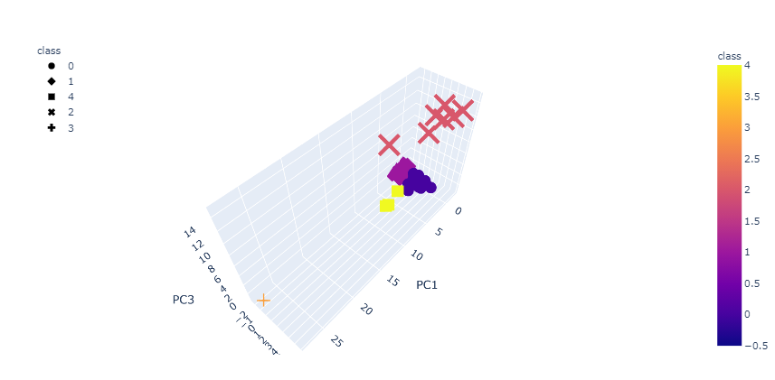

# Cryptocurrencies

Project description

Use the Elbow Curve to Determine the Best K Value

3D plot

The table below shows 

Two outstandidng cryptocurrencies in the table 3 are shown below in 3D graph

